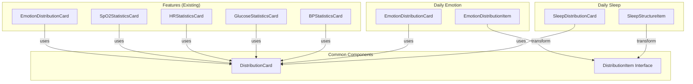

# Design Document: Distribution Card Refactor

## Overview

This design document describes the refactoring of `EmotionDistributionCard` and `SleepDistributionCard` components to use the common `DistributionCard` component. The refactoring eliminates code duplication while maintaining identical visual appearance and functionality.

The approach involves:
1. Extending the `DistributionCard` component with new props to support sleep and emotion use cases
2. Refactoring `SleepDistributionCard` to use the enhanced common component
3. Refactoring `EmotionDistributionCard` (daily) to use the enhanced common component

## Architecture



## Components and Interfaces

### Enhanced DistributionItem Interface

```typescript
export interface DistributionItem {
    /** Unique type/key identifier */
    type: string
    /** Display label */
    label: string
    /** Percentage value (0-100) */
    percent: number
    /** Count value (optional, for count mode) */
    count?: number
    /** Color for this item */
    color: string
    /** Duration display (optional, for sleep stages like "1h 30m") */
    duration?: string
    /** Status badge (optional, for sleep stages like "Good") */
    status?: string
}
```

### Enhanced DistributionCardProps Interface

```typescript
export interface DistributionCardProps {
    // Existing props (unchanged)
    title: string
    icon?: LucideIcon
    themeColor: string
    items: DistributionItem[]
    centerValue?: string | number
    centerLabel?: string
    showCount?: boolean
    columns?: 1 | 2
    gridColumns?: 1 | 2
    highlightValue?: number
    highlightLabel?: string
    highlightDescription?: string
    className?: string
    isLoading?: boolean
    showInfo?: boolean
    infoContent?: string | React.ReactNode
    
    // New props
    /** Custom icon element (for custom shapes like colored bars) */
    iconElement?: React.ReactNode
    /** Custom color for center value text */
    centerValueColor?: string
    /** Item layout mode */
    itemLayout?: 'default' | 'with-duration' | 'grid-2col'
    /** Pie chart size */
    pieChartSize?: 'auto' | 'small' | 'medium' | 'large'
}
```

### Component Hierarchy

```
DistributionCard (common)
├── Header
│   ├── Icon (LucideIcon) OR IconElement (React.ReactNode)
│   ├── Title
│   └── Info Icon
├── Metrics Section
│   ├── Highlight Mode (BP/Glucose)
│   ├── With-Duration Mode (Sleep)
│   ├── Grid-2col Mode (Emotion)
│   └── Default Mode (HR/SpO2)
└── Pie Chart
    ├── Donut Chart
    └── Center Label
```

## Data Models

### Sleep Data Transformation

```typescript
// Input: SleepStructureItem[]
interface SleepStructureItem {
    type: string      // e.g., 'deep', 'light', 'rem', 'awake'
    label: string     // e.g., 'Deep sleep'
    percent: number   // e.g., 25
    duration: string  // e.g., '1h 30m'
    status: string    // e.g., 'Good'
}

// Output: DistributionItem[]
// Transformation:
// - type → type
// - label → label
// - percent → percent
// - SLEEP_COLORS[type] → color
// - duration → duration
// - status → status
```

### Emotion Data Transformation

```typescript
// Input: EmotionDistributionItem[]
interface EmotionDistributionItem {
    type: string      // e.g., 'happy', 'calm', 'sad'
    label: string     // e.g., 'Happy'
    count: number     // e.g., 5
    percent: number   // e.g., 35
}

// Output: DistributionItem[]
// Transformation:
// - type → type
// - label → label
// - percent → percent
// - getEmotionColor(type) → color
// - count → count (optional)
```

## Correctness Properties

*A property is a characteristic or behavior that should hold true across all valid executions of a system-essentially, a formal statement about what the system should do. Properties serve as the bridge between human-readable specifications and machine-verifiable correctness guarantees.*

### Property 1: Duration and Status Rendering

*For any* DistributionItem with a non-empty duration field, when rendered with itemLayout 'with-duration', the rendered output SHALL contain that duration string.

*For any* DistributionItem with a non-empty status field, when rendered with itemLayout 'with-duration', the rendered output SHALL contain that status string in a badge element.

**Validates: Requirements 1.3, 1.4**

### Property 2: IconElement Priority

*For any* DistributionCard with both `icon` and `iconElement` props provided, the rendered header SHALL contain only the iconElement and NOT the Lucide icon.

**Validates: Requirements 2.2, 2.3**

### Property 3: Center Value Color Application

*For any* DistributionCard with a `centerValueColor` prop, the center value text element SHALL have its color style set to that value. When `centerValueColor` is not provided, the center value SHALL use `themeColor`.

**Validates: Requirements 5.2, 5.3**

### Property 4: Pie Chart Auto-Sizing

*For any* DistributionCard with `pieChartSize` set to 'auto':
- If `columns === 2` OR `highlightValue !== undefined`, the chart container SHALL have dimensions w-48 h-48
- Otherwise, the chart container SHALL have dimensions w-32 h-32

**Validates: Requirements 4.5**

### Property 5: Sleep Data Transformation

*For any* valid SleepStructureItem array, the transformation to DistributionItem[] SHALL:
- Preserve all type, label, percent, duration, and status values
- Map type to the correct SLEEP_COLORS color
- Produce an array of the same length

**Validates: Requirements 6.2**

### Property 6: Emotion Data Transformation

*For any* valid EmotionDistributionItem array, the transformation to DistributionItem[] SHALL:
- Preserve all type, label, percent, and count values
- Map type to the correct EMOTION_COLORS color via getEmotionColor()
- Produce an array of the same length

**Validates: Requirements 7.2**

### Property 7: Backward Compatibility

*For any* DistributionCard rendered without the new props (iconElement, centerValueColor, itemLayout, pieChartSize), the rendered output SHALL be identical to the current implementation.

**Validates: Requirements 8.1, 8.2**

## Error Handling

### Invalid Props

| Scenario | Handling |
|----------|----------|
| Empty items array | Render placeholder gray circle in pie chart |
| Invalid itemLayout value | TypeScript compile error (union type) |
| Invalid pieChartSize value | TypeScript compile error (union type) |
| Missing required props | TypeScript compile error |

### Edge Cases

| Scenario | Handling |
|----------|----------|
| All items have 0% | Render placeholder gray circle |
| Duration/status undefined in with-duration mode | Render without those elements |
| Very long duration/status strings | CSS truncation with ellipsis |
| Many items (>8) in grid-2col mode | Render all items, may overflow |

## Testing Strategy

### Unit Tests

Unit tests will verify specific examples and edge cases:

1. **DistributionCard rendering modes**
   - Default layout renders correctly
   - With-duration layout shows duration and status
   - Grid-2col layout uses 2-column grid
   - Highlight mode renders large number

2. **Prop handling**
   - iconElement renders when provided
   - centerValueColor applies to center text
   - pieChartSize applies correct dimensions

3. **Edge cases**
   - Empty items array shows placeholder
   - Missing optional props use defaults

### Property-Based Tests

Property-based tests will use `fast-check` library to verify universal properties:

1. **Duration/status rendering property**
   - Generate random items with duration/status
   - Verify all values appear in rendered output

2. **Data transformation properties**
   - Generate random SleepStructureItem arrays
   - Verify transformation preserves all data
   - Generate random EmotionDistributionItem arrays
   - Verify transformation preserves all data

3. **Backward compatibility property**
   - Generate random valid props (existing only)
   - Verify output matches current implementation

### Manual Verification

After implementation, manually verify all 6 distribution card types:
1. Blood Pressure Statistics Card
2. Glucose Statistics Card
3. Heart Rate Statistics Card
4. SpO2 Statistics Card
5. Sleep Distribution Card (refactored)
6. Emotion Distribution Card (refactored)

### Test Configuration

- Property-based tests: minimum 100 iterations per property
- Test framework: Vitest with React Testing Library
- PBT library: fast-check
- Each property test tagged with: `**Feature: distribution-card-refactor, Property N: {property_text}**`
